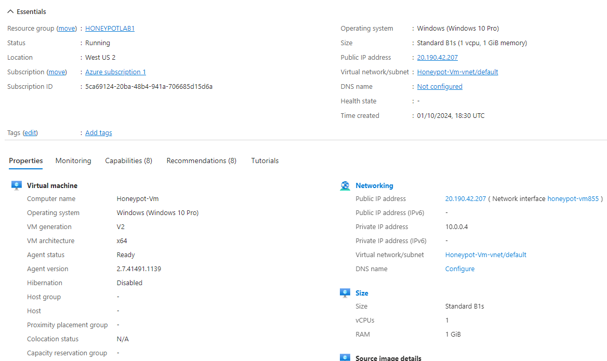
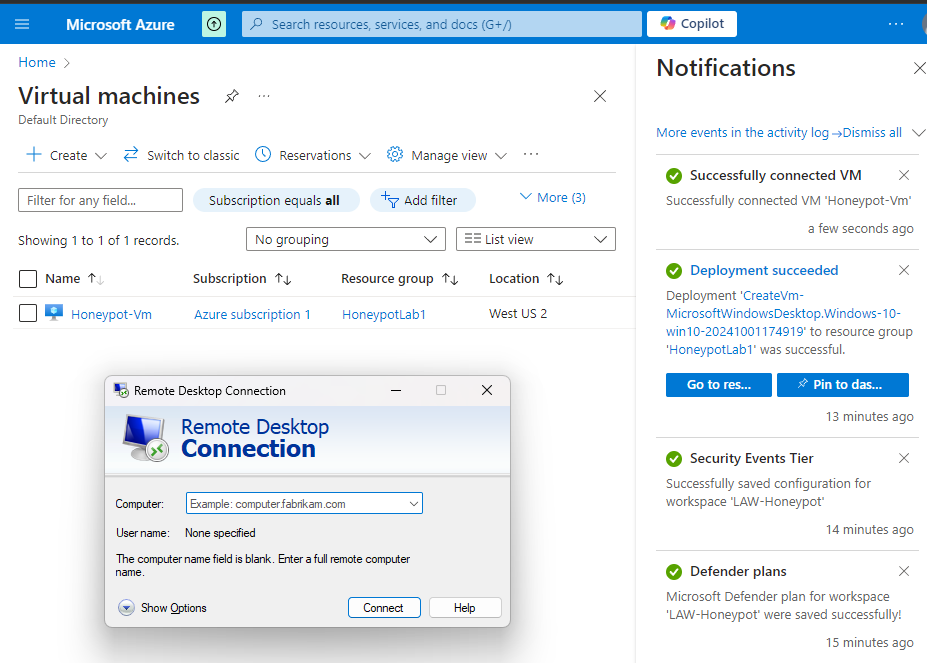
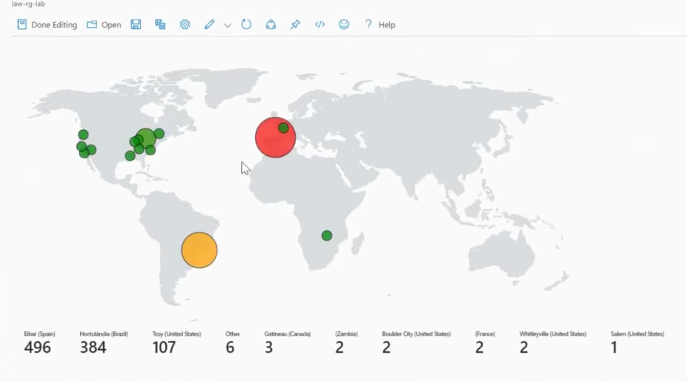

# Building my own SIEM

## Objective

The SIEM project aimed to establish a controlled environment for simulating and detecting cyber attacks. The primary focus was to ingest and analyze logs within a Security Information and Event Management (SIEM) system, generating test telemetry to mimic real-world attack scenarios. This hands-on experience was designed to deepen understanding of network security, attack patterns, and defensive strategies.

### Skills Learned

- Advanced understanding of SIEM concepts and practical application.
- Proficiency in analyzing and interpreting network logs.
- Ability to generate and recognize attack signatures and patterns.
- Enhanced knowledge of network protocols and security vulnerabilities.
- Development of critical thinking and problem-solving skills in cybersecurity.

### Tools Used

-  AZURE: Security Information and Event Management (SIEM) system for log ingestion and analysis.
- Micorosoft Sentinel
- IPgeolocation.IO -Tool used to convert the Ip adresses into latitude and longitude for the SIEM map to function and show where attacks were coming from.

## Screenshots of Project

Above is the The creation of the virtual machine.

Above is me Logging into the Azure virtual machine i created with remote desktop connection.This is the honeypot machine and is where the attacks will be coming from and shown on my SIEM.

 
 This is the final product of the lab was multiple attack attempts from all over the world. The Virtual Machine I created  had the firewall purposely configured so that it was easily discoverable much faster than usual from a simple ping/tcp scan. Allowing multiple attackers to attempt to gain access to the virtual machine which had no personal data in it ( hence why this project is called a honeypot)  .This allowed me to view multiple attacks and view them on the SIEM system I created .This helped me to understand how a SOC analyst for example views potential attacks on the systems they are defending. To gain the IP addresses of these attacks I paired the event viewer on the virtual machine (which showed each log-in attempt with their IP address) to IPgeolocation.io. I then gained the API key and had a Powershell ICE log which received each IP address and used it to calculate the latitude and longitude on the world map. This log was then entered into Microsoft Azure which helped show on the map where each log-in attempt was coming from. I only ran the virtual machine for 1 hour allowing myself to watch the real-life traffic of attacks on the virtual machine before shutting it down.
